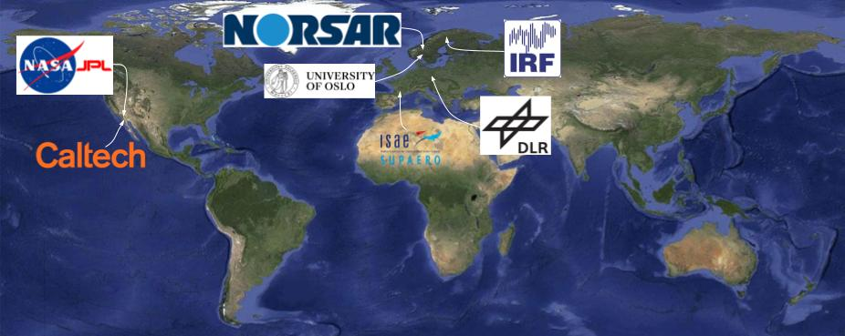
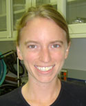
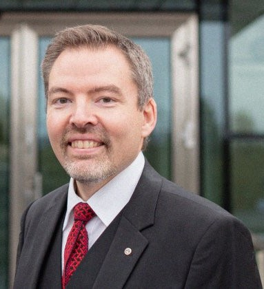
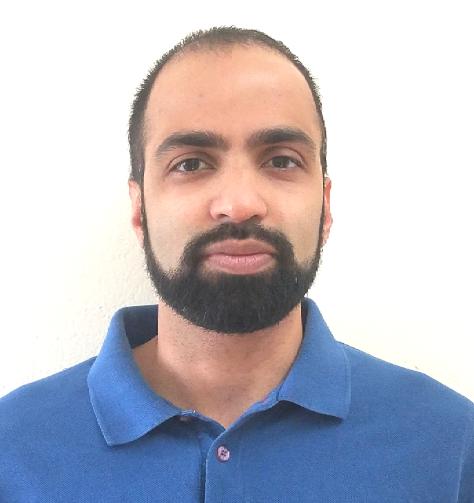
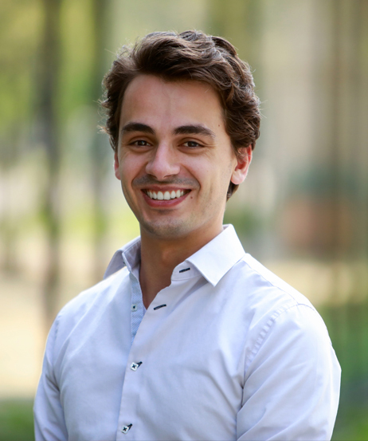
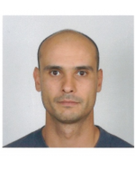
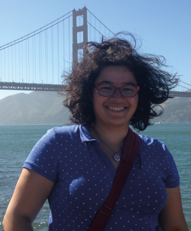

## Official team members

|   |   |
|---|---|
|  | **Quentin Brissaud**, PI Research Scientist at NORSAR, Norway Quentin Brissaud has extensive seismic and acoustic modeling and data analysis experience. <a href="https://quentinbrissaud.github.io/">https://quentinbrissaud.github.io/</a> |
|  | **Sven Peter Nasholm**, co-PI Professor at the University of Oslo, Norway <a href="https://www.mn.uio.no/ifi/english/people/aca/svenpn/">https://www.mn.uio.no/ifi/english/people/aca/svenpn/</a> |
|  | **Marouchka Froment** Post-doc at NORSAR, Norway |
|  | **Antoine Turquet** Research Scientist at NORSAR, Norway |
|  | **Tina Kaschwich** Principal Research Geophysicist at NORSAR, Norway |
|  | **Jennifer M Jackson** Professor of Mineral Physics, Caltech, USA <a href="https://web.gps.caltech.edu/~jackson/">https://web.gps.caltech.edu/~jackson/</a> |
|  | **Johan Kero** Research Scientist at IRF, Sweden <a href="https://www.irf.se/sv/news/tag/johan-kero/">https://www.irf.se/sv/news/tag/johan-kero/</a> |

## AIR collaborators

|   |   |
|---|---|
|  | **Siddharth Krishnamoorthy** Research Scientist at JPL/NASA, USA <a href="https://scienceandtechnology.jpl.nasa.gov/dr-siddharth-krishnamoorthy">https://scienceandtechnology.jpl.nasa.gov/dr-siddharth-krishnamoorthy</a> |
|  | **Leo Martire** Research Scientist at JPL/NASA, USA <a href="https://scienceandtechnology.jpl.nasa.gov/leo-martire">https://scienceandtechnology.jpl.nasa.gov/leo-martire</a> |
|  | **Raphael Garcia** Research Scientist at ISAE Toulouse, France <a href="https://pagespro.isae-supaero.fr/raphael-garcia/">https://pagespro.isae-supaero.fr/raphael-garcia/</a> |
|  | **Iris Van Zelst** Post-doc at DLR, Germany <a href="https://irisvanzelst.github.io/">https://irisvanzelst.github.io/</a> |

